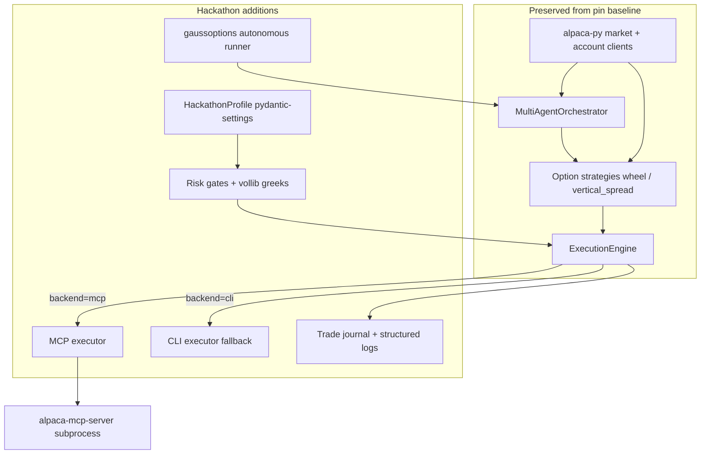

# Plan — Alpaca AI Trading Agents Hackathon

> **Event:** `alpaca-trading-agents-2026` · [Official page](https://lablab.ai/ai-hackathons/alpaca-ai-trading-agents-hackathon)
>
> **State target:** `PLAN_PENDING_APPROVAL` · **Foundation:** `pin-31374551` (user-selected)
>
> **Candidate report SHA-256:** `f5bc9bdaa51f191a40fff11d00683f989b3471c9c68b0bc9efa9a1c73f45837a` ✓ verified

---

## 1. Executive summary

Build **GaussOptions Agent** — an autonomous, options-first AI trading agent on Alpaca paper — by wiring the pinned MIT snapshot at `vendor/pin-31374551/` (commit `31374551bae6fd34a0fe56fe11d208f4ff04fbb4`) into an Alpaca-connected strategy/execution skeleton, multi-agent analysis loop, and existing options modules (`wheel`, `vertical_spread`, `TradingOptionEngine`).

The judged artifact is **not** a generic stock-trading platform demo. It is a **fresh-paper, options-mandatory, MCP-routed autonomous agent** that places real paper orders through **Alpaca MCP Server** (primary) with **Alpaca CLI** as a documented fallback, enforces **$100,000 paper risk gates** on the **already-created dedicated hackathon paper account**, and ships MIT-licensed submission materials including a one-page write-up, the paper account ID document, and a **Remotion-produced demo video** (not a screen recording). API keys never enter the repo or chat.

**Submission deadline:** 2026-09-04 08:00 PDT (America/Los_Angeles).

---

## 2. Event contract (verified)

| Requirement | Source | Plan response |
| --- | --- | --- |
| Autonomous AI trading agent | Event CORE REQUIREMENTS | Keep `MultiAgentOrchestrator`; add scheduled autonomous cycle with explicit agent decision → risk gate → MCP order path |
| Alpaca Trading API | Sponsor tech | Keep `alpaca-py` data/account clients; paper `TradingClient` for verification and contract discovery |
| Alpaca MCP **or** CLI for orders | Pass/fail gate | **Primary:** `alpaca-mcp-server` via MCP Python SDK; **Fallback:** official `alpacahq/cli` subprocess adapter |
| Strategy **must include options** | Pass/fail gate | Default live path runs option strategies only (`wheel`, `vertical_spread`); stock-only paths disabled in hackathon profile |
| Fresh Alpaca paper account, $100k | Pass/fail gate | Use the already-created dedicated $100k hackathon paper account; keys stay in local `.env` only; never commit secrets |
| Submit project (MIT), write-up, account ID | Submission rules | Repo MIT + `docs/SUBMISSION_WRITEUP.md` + `docs/ALPACA_ACCOUNT.md` template |
| Original work with prior-code disclosure | Terms §16 | `THIRD_PARTY_NOTICES.md` + README attribution for the pinned MIT snapshot and Alpaca SDKs |
| Solo team (1 person) | Guidelines | Single-operator build; no team coordination artifacts |

**Judging:** Official page does not publish numeric weights. Optimize for demonstrable autonomous options paper trading, clear AI/risk narrative, and sponsor toolchain compliance.

---

## 3. Foundation (pinned, preserved baseline)

| Field | Value |
| --- | --- |
| **ID** | `pin-31374551` |
| **Snapshot path** | `vendor/pin-31374551/` |
| **Pinned commit** | `31374551bae6fd34a0fe56fe11d208f4ff04fbb4` |
| **License** | MIT |
| **Reuse scope** | Code foundation with disclosure |

### Baseline to keep (do not rewrite)

- Python 3.12+ async platform layout (`src/`, `live_script.py`, CLI entry points)
- Alpaca data provider and account integration (`src/data/alpaca_provider.py`)
- Strategy → `ActionPlan` → `ExecutionEngine` layering
- Existing option strategies: `wheel`, `vertical_spread`
- `TradingOptionEngine` multi-leg order support
- `MultiAgentOrchestrator` and `RiskManagerAgent` patterns
- Streamlit dashboard shell (optional demo surface, not primary judged flow)

### Known baseline gaps (address in Build)

- Live orders today go through direct `alpaca-py` SDK in `ExecutionEngine`, **not** MCP/CLI (event pass/fail)
- Hackathon profile, fresh-account guardrails, and submission docs do not exist yet
- Autonomous loop exists for live CLI but is interactive-first; needs unattended profile for demo/E2E

---

## 4. Product direction

**Product name (working):** GaussOptions Agent

**One-line pitch:** An autonomous agent that analyzes underlyings with a multi-agent committee, selects option structures (wheel / vertical spreads) from the pin `wheel` and `vertical_spread` modules, passes configurable risk gates sized for a $100k paper book, and executes exclusively through Alpaca MCP on a dedicated hackathon paper account.

**Primary user flow (MVP):**

1. Operator starts agent with hackathon profile: `python -m gaussoptions run --profile hackathon --backend mcp`
2. Agent loads env-configured **fresh paper** Alpaca credentials and validates account equity ≈ $100k and options approval
3. Autonomous cycle runs on a configurable interval (default 15 min during market hours):
   - Fetch watchlist underlyings + option chains via `alpaca-py`
   - Multi-agent analysis produces consensus `ActionPlan`
   - Risk gates evaluate portfolio delta/vega, max position %, daily trade count, buying power
   - Approved plans route to **MCP executor** → `alpaca-mcp-server` tools for option order submit
   - Structured JSON logs + SQLite/JSON trade journal record every decision and order ID
4. Operator runs verification script to prove MCP order path and options leg on paper
5. Submission pack: repo, write-up, account ID doc, Remotion project + rendered demo MP4

**Differentiation vs the pin snapshot:** Mandatory MCP execution path, hackathon-only options-first profile, fresh-account compliance checklist, and submission-oriented documentation — not a generic multi-asset trading platform demo.

---

## 5. MVP scope

### In scope (Build automates)

1. **Vendor foundation** — Import pin commit `@31374551` into this repo under `vendor/pin-31374551/` with `FOUNDATION.md` recording commit, license, and modifications; wire as installable package or path dependency
2. **MCP execution adapter** — `src/trade/mcp/alpaca_mcp_executor.py` spawning `uvx alpaca-mcp-server==2.3.0`; integrate at `ExecutionEngine.execute_decision()` when `EXECUTION_BACKEND=mcp`
3. **CLI execution adapter (fallback)** — `src/trade/cli/alpaca_cli_executor.py` using official `alpacahq/cli`; selectable via `EXECUTION_BACKEND=cli`
4. **Hackathon profile** — `pydantic-settings` block: `starting_capital=100_000`, `require_options=true`, `execution_backend`, risk limits; enforced pre-order
5. **Options-first autonomous runner** — `gaussoptions run` module: unattended loop over option strategies only
6. **Risk gate hardening** — Extend existing limits with portfolio greeks checks using `vollib` (replace/enhance hand-rolled greeks)
7. **Verification & tests** — Unit tests for risk gates and MCP adapter mocking; integration script `scripts/verify-paper-mcp-order.py` (dry-run without live keys in CI; live paper run documented as env-only credentials)
8. **Submission docs + Remotion demo** — `docs/SUBMISSION_WRITEUP.md`, `docs/ALPACA_ACCOUNT.md` (ID only, no keys), `remotion/` source, rendered `artifacts/demo.mp4`, shot list, updated README, `THIRD_PARTY_NOTICES.md`
9. **Attribution** — Preserve MIT license chain; Apache-2.0 notices for Alpaca SDK/CLI

### Non-goals (explicitly out of Build scope)

- Live/real-money trading or mainnet/crypto brokerage paths
- Replacing the pin core with TradingAgents or TradeAgent architectures
- Hosted 24/7 production deployment or SaaS dashboard
- Social engagement prize campaign automation
- Winning-strategy alpha research / performance guarantees
- LangGraph full rewrite (optional future; not MVP)
- `riskfolio-lib` portfolio optimizer (optional stretch; excluded from MVP gate)

---

## 6. Rejected alternatives

| Alternative | Why rejected |
| --- | --- |
| **trading-agents** (`TauricResearch/TradingAgents`) | User selected `pin-31374551`. Apache-2.0 → MIT relicensing overhead; weaker existing Alpaca/options baseline |
| **trade-agent** (`enving/TradeAgent`) | User selected `pin-31374551`. No Alpaca-native platform; would discard closer baseline |
| **alpaca-mcp-server as foundation** | Candidate report excludes MCP server as product core; it is integration layer only |
| **Direct SDK-only execution** | Fails event pass/fail gate despite the pin default |
| **Stock-only multi-agent path** | Fails options requirement |
| **LangChain MCP adapters + LangGraph stack** | Heavier deps and `mcp` version conflict; defer unless MCP SDK path blocked |
| **Competing hackathon / gallery repos** | Forbidden by reuse policy |

---

## 7. Architecture



**Directory plan (post-Build):**

```
vendor/pin-31374551/           # pinned MIT snapshot
src/gaussoptions/              # hackathon profile, runner, config
src/trade/mcp/                   # MCP client + executor
src/trade/cli/                   # CLI executor
docs/                            # write-up, account template, demo script
scripts/verify-paper-mcp-order.py
tests/                           # unit + mocked integration
```

---

## 8. Approved reusable dependencies (Reuse Scout)

Builder may add only these unless Plan is revised:

| Package | Version pin | License | Integration |
| --- | --- | --- | --- |
| `alpaca-py` | ≥0.44.0 | Apache-2.0 | Data, chains, verification client |
| `alpaca-mcp-server` | 2.3.0 via `uvx` | MIT | Order placement subprocess |
| `mcp` | 2.1.1 | MIT | MCP Python client (`Client.call_tool`) |
| `vollib` | 1.0.11 | MIT | Greeks/IV in risk gates |
| `pydantic-settings` | ≥2.14.2 | MIT | Hackathon env config |
| Alpaca CLI (`alpacahq/cli`) | pinned tag in docs/Dockerfile | Apache-2.0 | Fallback executor |

**Explicitly excluded:** `mibian` (GPL), npm `alpaca-cli`, LangGraph stack (MVP), `riskfolio-lib` (MVP).

---

## 9. Credentials and user-only actions

### User-only (never automated by Builder/Agent)

| Action | When | Blocker if missing |
| --- | --- | --- |
| Register on lablab.ai event page | Before submission | Cannot submit |
| Dedicated $100k hackathon paper account (already created) | Live E2E / submit | Use this account only; do not open another |
| Provide paper API key/secret via local `.env` (never commit) | Before live verification | Live MCP order test blocked |
| Confirm account ID in `docs/ALPACA_ACCOUNT.md` (ID only) | At submission | Incomplete submission |
| Accept lablab/Alpaca terms, W-8BEN/KYC, bank details | If winning | Payout only |
| Final lablab platform submission | By 2026-09-04 08:00 PDT | — |
| Optional: LLM provider key (OpenAI/Anthropic/etc.) for `llm` multi-agent mode | For full agent demo | `fast` mode remains default without LLM key |

### Safe reversible defaults assumed

- **Execution backend:** MCP primary; CLI fallback documented
- **Agent mode:** `fast` multi-agent (no LLM billing) unless user supplies LLM keys
- **Autonomous interval:** 15 minutes; single-symbol watchlist default `SPY` for demo reproducibility
- **Paper account:** Use the existing dedicated $100k hackathon paper account. Builder uses fixtures in CI; live paper proof is local-credential gated and scripted. No keys in git.

---

## 10. Build phases (post-approval)

| Phase | Deliverable |
| --- | --- |
| **B1 Foundation import** | Vendor tree, NOTICES, runnable baseline smoke test |
| **B2 Execution adapters** | MCP + CLI paths wired through `ExecutionEngine` |
| **B3 Hackathon profile** | Settings, options-only guard, $100k checks |
| **B4 Autonomous runner** | `gaussoptions run` + logging/journal |
| **B5 Risk gates** | vollib greeks, pre-trade veto tests |
| **B6 Verification** | pytest suite + verify script + Remotion shot list |
| **B7 Submission pack** | Write-up, README, account ID doc, Remotion source + rendered `artifacts/demo.mp4` |

**Build branch (post-approval):** `cursor/alpaca-trading-agents-build-622b` off approved Plan commit.

---

## 11. Tests and quality gates

### MVP gate (Builder)

- `pytest tests/` — risk gates, settings validation, MCP adapter mock, execution routing
- `python -m compileall src/` — syntax check
- `python scripts/verify-paper-mcp-order.py --dry-run` — MCP order flow passes without keys
- Manual/automated smoke: `gaussoptions run --profile hackathon --once --dry-run` completes one cycle without error

### E2E (project-appropriate)

Full path: **config load → agent decision → risk gate → MCP tool call (fixture or live paper) → journal entry → verification script success**.

Live paper E2E with local Alpaca keys is scripted; CI uses `--dry-run`. Submission-ready evidence binds to commit with dry-run E2E passing plus a Remotion-rendered demo video. Keys never appear in git, Plan, or chat.

### Final review (Reviewer child)

Fresh Reviewer validates exact `buildId` commit against this Plan SHA, artifact locators, MIT/disclosure, options+MCP compliance, and test evidence.

---

## 12. Submission artifacts

| Artifact | Location | Owner |
| --- | --- | --- |
| MIT source repo | This GitHub repository | Builder |
| One-page write-up | `docs/SUBMISSION_WRITEUP.md` | Builder |
| Alpaca paper account ID | `docs/ALPACA_ACCOUNT.md` (ID only, no keys) | Confirm existing account at submit |
| Remotion demo video | `remotion/` source + `artifacts/demo.mp4` + shot list | Builder; formal video, not a screen recording |
| Third-party notices | `THIRD_PARTY_NOTICES.md` | Builder |

No hosted deployment URL required unless user later requests demo hosting (excluded from MVP).

---

## 13. Risks and mitigations

| Risk | Mitigation |
| --- | --- |
| Reused dev Alpaca account fails eligibility | Checklist + env validator; separate `HACKATHON_PAPER_ACCOUNT_ID` |
| MCP server version/API drift | Pin `alpaca-mcp-server==2.3.0`; adapter integration tests |
| Options paper permissions missing on new account | Preflight account capabilities check with clear error |
| Market closed during demo | `--dry-run` mode + recorded demo script; document market-hours requirement |
| Time pressure (deadline ~7 days) | MVP excludes LangGraph, portfolio optimizer, hosted deploy |
| Apache-2.0 Alpaca SDK in MIT repo | Standard NOTICE file; permitted combination |

---

## 14. Success criteria

1. Autonomous agent completes at least one full **options** decision cycle through **MCP** execution path (dry-run or live paper)
2. All pass/fail gates satisfied: options present, MCP or CLI used for orders, fresh-account workflow documented
3. pytest suite green; verify script passes in CI dry-run mode
4. Submission write-up covers AI logic, risk gates, Alpaca infra
5. Reviewer child returns `PASS` on immutable `buildId`
6. State reaches `SUBMISSION_READY` with artifact evidence for every requirement below

---

## 15. Attribution and disclosure duties

- README records the MIT pin at `vendor/pin-31374551/` commit `31374551bae6fd34a0fe56fe11d208f4ff04fbb4`
- `THIRD_PARTY_NOTICES.md`: Alpaca SDK (Apache-2.0), Alpaca MCP Server (MIT), Alpaca CLI (Apache-2.0), vollib (MIT), MCP SDK (MIT), pin LICENSE (`Copyright (c) 2026 Zexun Chen`)
- `docs/SUBMISSION_WRITEUP.md`: state which components are original hackathon work vs the pinned snapshot
- Do not remove LICENSE files in the vendor tree
- lablab submission: disclose AI coding tools used to build the agent (per hackathon AI policy)

---

## 16. Assumptions log

| ID | Assumption | Reversal |
| --- | --- | --- |
| A1 | MCP Python SDK v2 (`mcp>=2.1.1`) works with `alpaca-mcp-server` 2.3.0 | Fall back to CLI executor as primary |
| A2 | Pin option strategies (`wheel`, `vertical_spread`) produce paper OCC contracts | Patch vendor strategy modules in-place with attribution |
| A3 | `fast` multi-agent mode sufficient for MVP autonomous demo | User adds LLM key for `llm` mode post-approval |
| A4 | Single-underlying demo (`SPY`) acceptable for judges | Expand watchlist via env without Plan change |
| A5 | Dry-run MCP E2E satisfies Reviewer when live keys unavailable in CI | User runs live script before final submission |

---

## 17. Decisions for user inspection at approval

1. **Foundation locked:** `pin-31374551` @ `31374551bae6fd34a0fe56fe11d208f4ff04fbb4` — no substitution
2. **Execution primary:** Alpaca MCP Server; CLI fallback only
3. **MVP agent mode:** `fast` (no LLM API cost) unless user opts in with keys
4. **Demo symbol:** SPY options wheel/vertical spread rotation
5. **No hosted deployment** in artifact contract
6. **Paper account** is the already-created dedicated $100k hackathon account; keys stay local
7. **Demo video** is Remotion-produced and bound to `buildId`; a screen recording or empty script fails review

Revise via natural language in this Project Root thread; each revision updates this file and invalidates prior approval commands.

```hackathon-artifact-requirements
[
  {
    "id": "submission-repository",
    "kind": "repository",
    "source": "event_rules",
    "description": "MIT-licensed project repository containing the autonomous options trading agent and submission documentation."
  },
  {
    "id": "submission-writeup",
    "kind": "document",
    "source": "event_rules",
    "description": "One-page write-up covering AI decision logic, risk gates, and Alpaca infrastructure (MCP/CLI, paper account workflow)."
  },
  {
    "id": "alpaca-paper-account-id",
    "kind": "document",
    "source": "event_rules",
    "description": "Dedicated $100k Alpaca paper account ID already created for this hackathon, recorded as ID-only in docs/ALPACA_ACCOUNT.md. Never store API keys in the repository."
  },
  {
    "id": "alpaca-mcp-cli-integration",
    "kind": "integration",
    "source": "event_rules",
    "description": "Working Alpaca MCP Server or official Alpaca CLI execution path that places real paper option orders, verified by scripts/verify-paper-mcp-order.py."
  },
  {
    "id": "options-trading-strategy",
    "kind": "integration",
    "source": "event_rules",
    "description": "Autonomous agent strategy that includes options trades (wheel and/or vertical spreads) on Alpaca paper, not stock-only execution."
  },
  {
    "id": "remotion-demo-video",
    "kind": "video",
    "source": "approved_plan",
    "description": "Formal Remotion-produced demo video of the autonomous options agent (decision, risk gate, MCP/CLI paper order). Source in remotion/, rendered MP4 at artifacts/demo.mp4, plus shot list. Screen recordings or empty scripts do not satisfy this requirement."
  },
  {
    "id": "third-party-notices",
    "kind": "document",
    "source": "approved_plan",
    "description": "THIRD_PARTY_NOTICES.md and README attribution for the pinned MIT snapshot and Alpaca SDK/MCP/CLI dependencies."
  }
]
```
