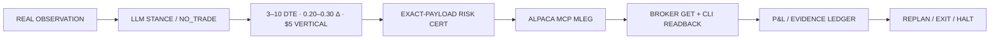
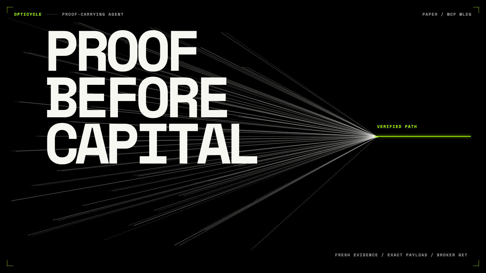

# Opticycle

**A proof-carrying SPY options agent.**

| Three reasons it is different | What the judge can verify |
| --- | --- |
| **The LLM cannot place a trade.** | It chooses only `BULLISH` / `BEARISH` / `NO_TRADE`; deterministic code selects legs, price, and risk-budgeted quantity. |
| **Authorization is inseparable from the order.** | A short-lived certificate binds the exact MLEG payload hash; any mutation is vetoed. |
| **Execution is guilty until proven reconciled.** | Official Alpaca MCP submits once, broker GET verifies the same client order, and unknown state means zero resubmit + `HALT`. |

**Realized P&L to date: approximately +$56** across two closed paper spreads before fees and rounding. Alpaca account equity remains authoritative.

## Paper equity


Source: `GET /v2/account/portfolio/history`, paper account `PA3V84C40PJQ`. Machine-readable points: [`portfolio_history.json`](artifacts/evidence/portfolio_history.json).

## One closed loop



## 60-second proof: three broker receipts

These receipts prove the live MCP/certificate/readback loop. They predate the current selector policy, which is now constrained to 3–10 DTE, $5 width, and 0.20–0.30 short-leg delta; they are not presented as current-policy trade samples.

| Broker receipt | Exact order | Result | Proof |
| --- | --- | --- | --- |
| `abcb5385-0aa3-42cc-9b58-ef4200235c27` | SPY 793C/809C bear call · qty 1 | filled `-2.11` | Alpaca GET receipt; later closed via MCP |
| `2a6d6b7c-caad-4c24-959a-8d93455a36fe` | SPY 768C/769C bear call · qty 1 | filled `-0.51` | Alpaca GET receipt; later closed via MCP |
| `24b16fe6-0d8d-4478-afa6-0f3781eb6b33` | SPY 740P/724P bull put · qty 1 · limit `-2.26` | price-bound `MATCHED` at `-2.26` | ThesisAgent called; cert bound; `mcp_submit_count=1`; `second_submit=false` |

Open the [Judge packet](artifacts/evidence/index.html) to trace `SNAPSHOT → LLM STANCE → PAYLOAD → CERT → MCP → GET → MATCHED`. The two completed spreads realized approximately **+$58** and **−$2** before fees/rounding; Alpaca flatten equity was **$100,055.67**. The third receipt remains the golden live price-bound match.

[](artifacts/demo.mp4)

## What runs every 30 minutes

- Reads the paper account, SPY quote/bars, option chain, positions, orders, and fills.
- Adds 20-day realized volatility, current-chain IV rank, 25-delta put/call skew, five-day range, and the verified NFP event clock to ThesisAgent evidence.
- Builds only a 3–10 DTE, $5-wide SPY bull-put or bear-call credit vertical with short-leg delta 0.20–0.30.
- Sizes each vertical to an exact 2% max-loss budget, caps aggregate open risk at 8%, preserves the independent 8% position hard cap, and limits size to four contracts per vertical.
- Counts structures rather than contracts: at most two new verticals per day and four verticals open. Quantity remains a risk-budget output, typically three to four contracts when the spread economics permit it.
- Exits at 50% credit captured, 2× credit loss, ≤1 DTE, or the pre-NFP ≤2 DTE flatten window.
- Sends every entry and exit through MCP `place_option_order` with `order_class=mleg`; CLI is read-only evidence, never an execution fallback.

## Reproduce without credentials

```bash
python3 -m pip install -r requirements-hackathon.txt
PYTHONPATH=vendor/pin-31374551:src python3 -m opticycle run --profile hackathon --backend mcp --once --dry-run
PYTHONPATH=vendor/pin-31374551:src python3 scripts/assert-zero-resubmit.py
UV_CACHE_DIR=/tmp/opticycle-uv-cache uv run --extra dev pytest -q
```

Live paper runs require `ALPACA_API_KEY`, `ALPACA_SECRET_KEY`, and `OPENAI_API_KEY`. Verify credentials without printing them:

```bash
python3 scripts/verify-paper-account.py
python3 scripts/capture-alpaca-cli-evidence.py
python3 scripts/build-equity-curve.py
python3 scripts/build-walk-forward-backtest.py
PYTHONPATH=vendor/pin-31374551:src python3 scripts/run-open-session.py --submit
```

## Evidence

- [Public Judge packet](artifacts/evidence/index.html)
- [Rendered demo](artifacts/demo.mp4)
- [Independent Alpaca GET receipts](artifacts/evidence/broker_lookup.json)
- [Sanitized fill summary](artifacts/evidence/paper_fill_ingest.json)
- [Modeled walk-forward research — not broker P&L](artifacts/evidence/walk-forward-backtest.html)
- [Foundation disclosure](FOUNDATION.md)

## Honesty notes

- The first two historical fills used debit-positive limits for intended credits. They are real broker `FILLED` records, but not price-bound `MATCHED`; the production path now requires negative credit limits. Only `oc-63db2a85298b4ecabefab59076a6397e` is the live price-bound `MATCHED` entry.
- The first two spreads were closed on 2026-09-01 by official MCP MLEGs. Their approximate spread P&L is computed from broker entry credit minus close debit; the broker account equity is the authoritative result.
- The walk-forward uses IEX daily stock bars and Black-Scholes modeled option prices. It is labeled research context and is not historical option-chain, fill, or broker P&L evidence.
- Keyless dry-run uses a fixture market and never claims a live ThesisAgent call, MCP submit, fill, or P&L.
- Missing/stale quotes, missing Greeks, a mutated payload, account mismatch, duplicate client ID, or unknown broker state produce `NO_TRADE` / `HALT`; the agent never splits a vertical into naked legs or changes transport after timeout.
- The MIT foundation is Gauss World Trader pinned at `31374551bae6fd34a0fe56fe11d208f4ff04fbb4`; new competition code and reuse scope are disclosed in [FOUNDATION.md](FOUNDATION.md) and [THIRD_PARTY_NOTICES.md](THIRD_PARTY_NOTICES.md).

MIT licensed.
