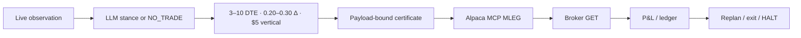

# Opticycle


Autonomous paper trader for SPY defined-risk credit verticals on Alpaca.

ThesisAgent sees live market evidence and may only say `BULLISH`, `BEARISH`, or `NO_TRADE`. Code picks the 3–10 DTE, $5-wide spread, sizes it, binds a certificate to the exact MLEG payload, and sends one order through official Alpaca MCP Server 2.3.0. If the broker reply is missing after accept, the agent looks up the same `client_order_id` and does not submit again.

**Closed-spread P&L so far: about +$56** before fees and rounding. Alpaca account equity is the source of truth.

## Paper equity


Source: Alpaca `GET /v2/account/portfolio/history`. Points: [`portfolio_history.json`](artifacts/evidence/portfolio_history.json). Paper account ID is in [`docs/ALPACA_ACCOUNT.md`](docs/ALPACA_ACCOUNT.md).

## Cycle



The model never chooses OCC symbols, quantity, or limit price.

## Broker receipts

These three paper fills are real Alpaca orders. The first two used a debit-positive limit on an intended credit, so they are `FILLED`, not price-bound `MATCHED`. Only the third fill is a live price-bound match (`filled <= limit`).

| Order | Structure | Result |
| --- | --- | --- |
| `abcb5385-0aa3-42cc-9b58-ef4200235c27` | SPY 793C/809C bear call · qty 1 | filled `-2.11`, later closed via MCP |
| `2a6d6b7c-caad-4c24-959a-8d93455a36fe` | SPY 768C/769C bear call · qty 1 | filled `-0.51`, later closed via MCP |
| `24b16fe6-0d8d-4478-afa6-0f3781eb6b33` | SPY 740P/724P bull put · qty 1 · limit `-2.26` | filled `-2.26` · one MCP submit |

The two completed spreads realized about **+$58** and **−$2**. Flatten equity after those closes was **$100,055.67**.

[](artifacts/demo.mp4)

## Policy

- One new structure is a 3–10 DTE, $5-wide SPY bull-put or bear-call with short-leg delta 0.20–0.30.
- Size is a 2% max-loss budget, at most four contracts, 8% aggregate open risk, two new verticals a day, four open.
- Exits: 50% credit captured, 2× credit loss, ≤1 DTE, or the pre-NFP ≤2 DTE flatten window.
- Entries and exits use MCP `place_option_order` / `order_class=mleg` only.

## Run

```bash
python3 -m pip install -r requirements-hackathon.txt
PYTHONPATH=vendor/pin-31374551:src python3 -m opticycle run --profile hackathon --backend mcp --once --dry-run
PYTHONPATH=vendor/pin-31374551:src python3 scripts/assert-zero-resubmit.py
UV_CACHE_DIR=/tmp/opticycle-uv-cache uv run --extra dev pytest -q
```

Dry-run uses a fixture market and does not call a live model or the broker.

Live paper needs `ALPACA_API_KEY`, `ALPACA_SECRET_KEY`, and `OPENAI_API_KEY` (`ALPACA_PAPER_TRADE=true`, `ALPACA_LIVE_TRADE` must stay false):

```bash
python3 scripts/verify-paper-account.py
PYTHONPATH=vendor/pin-31374551:src python3 scripts/run-open-session.py --submit
```

## More

- [Evidence page](artifacts/evidence/index.html)
- [Demo](artifacts/demo.mp4)
- [Alpaca GET receipts](artifacts/evidence/broker_lookup.json)
- [Walk-forward research (modeled, not broker P&L)](artifacts/evidence/walk-forward-backtest.html)
- [Foundation](FOUNDATION.md)

The first two historical fills stay `FILLED` because of the limit-sign error. Keyless dry-run and the IEX / Black-Scholes walk-forward are not live fills. Stale quotes, a mutated payload, or unknown broker state yield `NO_TRADE` / `HALT`.

MIT. Gauss World Trader is pinned at `31374551bae6fd34a0fe56fe11d208f4ff04fbb4`; see [FOUNDATION.md](FOUNDATION.md) and [THIRD_PARTY_NOTICES.md](THIRD_PARTY_NOTICES.md).
