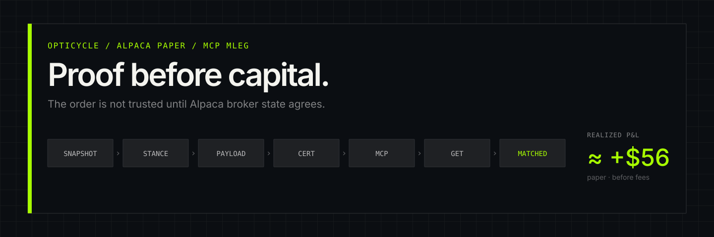
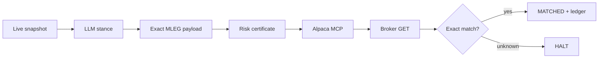
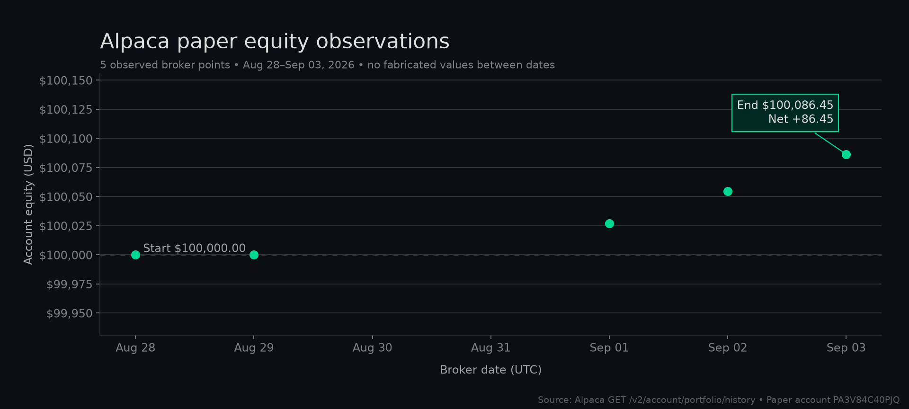
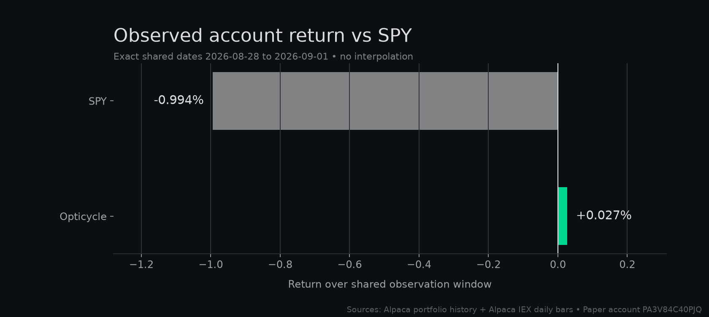

<p align="center">
  <a href="artifacts/demo.mp4">
    
  </a>
</p>

<p align="center">
  <strong>A proof-carrying SPY options agent.</strong><br />
  Fresh evidence in. One certified MLEG out. Broker state decides what is true.
</p>

<p align="center">
  
  
  
  
</p>

<p align="center">
  <a href="artifacts/demo.mp4"><strong>Watch the 43-second demo</strong></a>
  · <a href="artifacts/evidence/index.html">Open the evidence ledger</a>
  · <a href="artifacts/opticycle-one-page.pdf">Read the one-page</a>
  · <a href="artifacts/opticycle-slides.pptx">Open the slides</a>
</p>

| LIVE BROKER PROOF | EXECUTION INTEGRITY | REALIZED PAPER P&L |
| :---: | :---: | :---: |
| **3 option fills** | **1 submit · 0 resubmits** | **+$55.67** |
| 1 signed-credit price match | same client ID through broker GET | closed spreads, before fees |

Opticycle trades one narrow instrument well: 3–10 DTE, $5-wide SPY credit verticals. The LLM may only return `BULLISH`, `BEARISH`, or `NO_TRADE`; deterministic code owns contracts, quantity, price, risk, execution, and exits.

## The verified path



### Two invariants

**Byte-bound authorization.** A short-lived certificate binds the canonical order payload. Changing a symbol, side, ratio, quantity, limit, or intent invalidates the trade.

**Zero-resubmit reconciliation.** An uncertain MCP response triggers broker lookup with the same `client_order_id`—never a second order and never split legs. Reproduce this behavior without credentials:

```bash
python3 scripts/assert-zero-resubmit.py
python3 scripts/assert-exits-only.py
```

## Broker trail

| Order | Certified structure | Broker result |
| --- | --- | --- |
| `abcb5385…` | SPY 793C/809C bear call · 1× | filled `-2.11`; closed through MCP · **≈ +$58** |
| `2a6d6b7c…` | SPY 768C/769C bear call · 1× | filled `-0.51`; closed through MCP · **≈ −$2** |
| `24b16fe6…` | SPY 740P/724P bull put · 1× · limit `-2.26` | filled `-2.26` · live price-bound **MATCHED** |

Paper account `PA3V84C40PJQ` started at $100,000. The evidence keeps each broker metric at its own observation time:

| Broker metric | Value | Meaning |
| --- | ---: | --- |
| Closed-spread realized P&L | **+$55.67** | $100,055.67 flatten equity after the first two spreads closed |
| Open-position unrealized P&L | **−$19.00** | Sep 1 committed Alpaca CLI snapshot |
| Account equity | **$100,036.62** | same Sep 1 CLI snapshot; the latest committed account truth |
| Historical equity observation | **$100,026.77** | older portfolio-history endpoint; chart point, not current equity |

At the rounded public precision, `$100,000 + $55.67 − $19.00 = $100,036.67`, within $0.05 of the broker equity because the public leg marks are rounded.

<p align="center">
  
  
</p>

The left chart comes from Alpaca `GET /v2/account/portfolio/history`. The right chart compares exact shared endpoints without interpolation. Raw inputs: [`portfolio_history.json`](artifacts/evidence/portfolio_history.json) and [`equity-vs-spy.json`](artifacts/evidence/equity-vs-spy.json).

## Risk contract

| Control | Enforced rule |
| --- | --- |
| Structure | SPY bull-put or bear-call · 3–10 DTE · $5 width · short leg 0.20–0.30 delta |
| Sizing | 2% max-loss budget · max 4 contracts per vertical · 8% total open risk |
| Frequency | max 2 new verticals per day · max 4 open verticals |
| Exit | 50% credit captured · 2× credit loss · ≤1 DTE · pre-NFP ≤2 DTE flatten |
| Failure | stale evidence, payload mutation, or unknown broker state → `NO_TRADE` / `HALT` |

All entry and exit mutations use official `alpaca-mcp-server==2.3.0` with `place_option_order` and `order_class=mleg`. The Alpaca CLI is read-only evidence, never an execution fallback.

## Run once

```bash
python3 -m pip install -e .

# Keyless replay: fixture market, no live model, no broker call
python3 -m opticycle run --profile hackathon --backend mcp --once --dry-run

# Targeted proof
python3 scripts/assert-zero-resubmit.py
python3 scripts/assert-exits-only.py
```

Live paper mode requires `ALPACA_API_KEY`, `ALPACA_SECRET_KEY`, and `OPENAI_API_KEY`; `ALPACA_PAPER_TRADE=true` and `ALPACA_LIVE_TRADE=false` are mandatory.

```bash
python3 scripts/verify-paper-account.py

# Observe + ThesisAgent only; never submits an order
python3 scripts/run-open-session.py

# Manage existing positions only; never enters a new spread
python3 scripts/run-open-session.py --exits-only
```

## Evidence map

- **Broker truth:** [`broker_lookup.json`](artifacts/evidence/broker_lookup.json) and [`sanitized_fills/`](artifacts/evidence/sanitized_fills/)
- **Append-only public ledger:** [`public.jsonl`](artifacts/evidence/public.jsonl)
- **Release manifest:** [`manifest.json`](artifacts/evidence/manifest.json) — artifact hashes; Pages stamps its exact deployment commit
- **Evidence dashboard:** [`artifacts/evidence/index.html`](artifacts/evidence/index.html)
- **Policy-aligned research:** [`walk-forward-backtest.html`](artifacts/evidence/walk-forward-backtest.html) — **MODELED**, not broker P&L
- **Rendered demo:** [`artifacts/demo.mp4`](artifacts/demo.mp4)
- **One-page write-up:** [`artifacts/opticycle-one-page.pdf`](artifacts/opticycle-one-page.pdf)
- **Presentation slides:** [`artifacts/opticycle-slides.pptx`](artifacts/opticycle-slides.pptx)

<details>
<summary><strong>Honesty notes</strong></summary>

The first two real credit entries used the wrong positive limit sign, so they remain `FILLED`, not price-bound `MATCHED`. Production now requires a negative credit limit; the third entry is the only live price-bound match. Keyless dry-run is not a live fill. The modeled walk-forward uses prior-only IEX bars, a declared 1.20× IV/RV assumption, and the live exit rules; it is research evidence, not account performance.

</details>

## License

Opticycle is released under the [MIT License](LICENSE), © 2026 Yun-0000.
